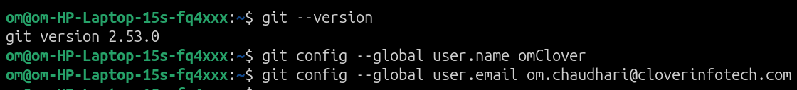

Section A: Git Basics + Setup
Q1.Check if Git is installed. What version do you have? Use Command

Q2.Set your name and email in global config.

 
Q3.Create a new folder `git-assignment-YourName` and run `git init` inside it. Check the status.

 
Q4.Create a `README.md` file with content `# Git Assignment - YourName`. Stage it and commit with message "Initial commit".

 
Q5.Run `git log` and copy the hash ID of your first commit into `answers.md`.

1a24ccdda45d243fd050c0879847d2548888d719
 
Q6.Perform few changes and make a five commits.
This is  change one
This is change two
This is change three
This is change four
This is change five

 

Section B: Branching & Commits
 
Q6.Create a new branch named `dev` and switch to it. Show the branch list.

 
Q7. On the `dev` branch, create `features.txt`. Add 3 lines: "Login", "Signup", "Dashboard". Commit the changes.

 
Q8. Switch back to `main`/`master` branch. Is `features.txt` visible? It should not be. Write the reason.

The file is not visible in the branch ‘master’ because it only present in the snapshot of ‘dev’ branch and doesn’t merged into ‘master’ branch
 

Q9. Merge `dev` into `main`. After merging, take a screenshot of `git log –oneline.

 
Q10. Create a `.gitignore` file. Add `node_modules/` and log` to it. Commit the file.

 
Section C: GitHub Remote + Push/Pull
 
Q11.Create a new empty repo on GitHub named `git-assignment-YourName`. Do not initialize with README.

Q12.Connect your local repo to the GitHub remote.

git remote add origin https://github.com/OmClover/git-assignment-om.git

Q13.Push your local code to GitHub.

 
Q14. Go to GitHub and paste your repo link in.

https://github.com/OmClover/git-assignment-om.git
 
Q15.Create a file directly on GitHub named `bugfix.txt` with content "Bug 1 fixed". Now run `git pull` locally to fetch that file.

 

Section D: Undo, Conflicts & Collaboration
 
Q16. Add a line "Testing undo" to `README.md`. Do not stage it. Now discard the changes using `git restore README.md`. Verify it worked.

 
Q17. The last commit message was wrong. Change it to "Initial commit - Added README".  
Hint: `git commit –amend`

 
Q18. Conflict Task:
   1. On `main` branch, create `conflict.txt` with "Line from main" and commit
   2. Create a new branch `conflict-branch`, change the same file to "Line from branch" and commit
   3. Try to merge into `main` - you will get a conflict
   4. Manually resolve the conflict, keep both lines, and commit. Show the final content of `conflict.txt`.

 
Q19. Fork a colleague's repo and clone it locally. Write the repo name in `answers.md.

Repository Name: git-assignment-vivek.git

Q20.Add a collaborator to your `git-assignment-YourName` repo. Settings > Collaborators > Add people. Take a screenshot.

